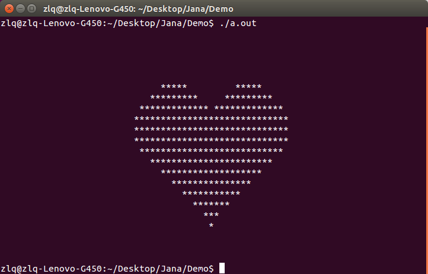

## Documents:

[中文文档](./docs-zh-cn)

## Usage:

```
$ sudo apt-get install gcc-4.8-multilib g++-4.8-multilib
$ cd ./src
$ g++ -std=c++11 jana.cpp -o JANA
$ mv JANA ../demo/
$ cd ../demo

```

Copy your jana-source-files to the `./demo` folder which contains `JANA`, `./lib` folder.

```
$ ./JANA sourcefiles*.jana -o target
$ ./target
```

## Standard-libaray:

A standard libaray is provided.
source files can be found in ./lib.

## Demos

Demos can be found in ```./demo/examples``` folder.

## Run:



